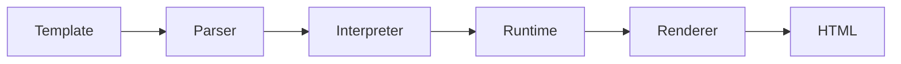

# Template Preview

> Local development environment for HTML email templates powered by Scriban, with live preview, mock data, reusable components and a dedicated rendering API.

<p align="center">
  
  
  
  
  
  
  
  
  
  
</p>

Template Preview is a development tool for building and validating HTML email templates without repeatedly publishing them to an external platform.

The project provides a rendering engine, API, persistence layer, authentication and resources for templates, projects, components and mock data.

The web application is currently only a Next.js scaffold and is not yet implemented as part of the product.

> 🚧 **Current status:** Active development. The current focus is the API, rendering engine and application architecture. The web interface is planned for a future stage.

<br>

## 💡 Why?

Developing HTML email templates can be slow when every change needs to be published to an external platform before the final result can be validated.

Template Preview is being built to provide a local development workflow where templates can be rendered with controlled data and validated before being published to a production email platform.

The project separates the rendering engine from the application API so the template processing logic can evolve independently from the rest of the application.

<br>

## ✨ Current Features

The current implementation includes:

- HTML template rendering
- Scriban-based template processing
- Template parser and interpreter
- Rendering runtime
- Custom template functions
- Projects
- Templates
- Reusable components
- Mock data
- Preview endpoint
- Authentication
- Database persistence
- API validation with Zod
- Swagger/OpenAPI support
- Automated tests
- ESLint and Prettier configuration

<br>

## 📐 Architecture

The project is organized as a pnpm workspace with two main applications:

```text
template-preview/
├── api/
├── web/
├── package.json
├── pnpm-workspace.yaml
└── pnpm-lock.yaml
```

However, their implementation status is different.

### API

The API is the main implemented application.

It contains:

- HTTP server
- authentication
- application routes
- database access
- business logic
- template rendering
- validation
- tests

The API is built with:

- Node.js
- TypeScript
- Fastify
- Zod
- Drizzle ORM
- PostgreSQL / Neon
- Better Auth
- Swagger/OpenAPI
- Jest
- Web

The web/ directory currently contains a Next.js project scaffold.

It is not yet the Template Preview application.

At the moment it contains the default Next.js application structure and configuration, but there is no implemented template editor, project management interface or preview workspace.

The frontend will be implemented in a future stage.

<br>

## 🧠 Rendering Engine

The rendering engine is currently one of the main components of the project.

It is responsible for processing templates and producing the final HTML output.

The engine is organized into independent modules:

```text
api/src/engine/
├── core/
├── functions/
├── interpreter/
├── parser/
├── renderer/
├── runtime/
└── index.ts
```

The rendering flow is conceptually organized as:



## 📦 Projects

Projects provide the top-level organization for Template Preview resources.

A project can contain:

- Templates
- Components
- Mocks
- Project artifacts

Projects are persisted in the database and associated with users.

## 📨 Templates

Templates contain the source used by the rendering engine.

A template belongs to a project and contains its template content.

Templates can be rendered through the preview API using the rendering engine.

The current implementation stores templates in the database rather than relying exclusively on files in the repository.

## 🧩 Components

Components are reusable pieces of template content.

Each component belongs to a project and can define parameters that control how it is used inside templates.

The component model currently supports:

- Component content
- Parameters
- Required parameters
- Availability across pages
- Availability inside emails

Components are persisted independently from templates.

## 🧪 Mocks

Mocks provide controlled data for template rendering.

Each mock belongs to a project and contains the data that can be supplied to the rendering process.

This makes it possible to test templates with predictable input without depending on production data.

## 👁️ Preview

The API exposes a preview flow responsible for rendering template content.

The preview process receives the template and rendering context and passes it through the rendering engine to produce HTML.

The preview functionality is currently available through the API.

A visual preview interface will be implemented as part of the future web application.

## 🔐 Authentication

The API includes authentication infrastructure powered by Better Auth.

The current configuration supports credentials for:

- Better Auth
- Google
- GitHub

Authentication data is persisted in the database.

The application currently models users, sessions, accounts and verification records.

## 🗄️ Database

The project uses Drizzle ORM with PostgreSQL.

The current schema contains the main application entities required by the API:

```text
User
│
├── Sessions
├── Accounts
└── Projects
   ├── Templates
   ├── Components
   ├── Mocks
   └── Project Artifacts
```

Database configuration and migrations are managed through Drizzle.

The project is currently configured to work with a PostgreSQL-compatible database such as Neon.

## ⚡ Getting Started

### Requirements

- Node.js 22+
- pnpm 11+

### Installation

Clone the repository:

```bash
git clone https://github.com/itsmesiq/template-preview.git
```

Install dependencies:

```bash
pnpm install
```

### Enviroment

Create the API environment file:

```bash
cp api/.env.example api/.env
```

The current environment configuration contains:

```text
PORT=
DATABASE_URL=
BETTER_AUTH_SECRET=
BETTER_AUTH_URL=
GOOGLE_CLIENT_ID=
GOOGLE_CLIENT_SECRET=
GITHUB_CLIENT_ID=
GITHUB_CLIENT_SECRET=
WEB_APP_BASE_URL=
```

Only configure the providers and services required for your local environment.

### Development

Start the development server:

```text
pnpm dev
```

<br>

## 📚 API Documentation

The API includes Swagger/OpenAPI support.

When the development server is running, the API documentation can be accessed through the Swagger endpoint configured by the server.

The API is currently the primary interface for interacting with the application.

<br>

## 🧱 Development Principles

The project is being developed around a few core principles.

### Separation of concerns

The rendering engine should not depend directly on HTTP or persistence concerns.

### Modular rendering

Parsing, interpretation, runtime behavior and rendering are kept in separate modules.

### Explicit domain boundaries

Projects, templates, components and mocks are modeled as independent resources.

### Fast feedback

The rendering API should make it possible to validate templates locally without publishing them to an external platform.

### Incremental development

The project is intentionally being built in stages.

The API and rendering engine are currently ahead of the frontend implementation.

<br>

## 📁 Project Structure

The implemented backend is organized into separate responsibilities:

```text
api/
├── src/
│ ├── db/
│ │   ├── index.ts
│ │   └── schema.ts
│ │
│ ├── engine/
│ │   ├── core/
│ │   ├── functions/
│ │   ├── interpreter/
│ │   ├── parser/
│ │   ├── renderer/
│ │   └── runtime/
│ │
│ ├── errors/
│ ├── lib/
│ ├── plugins/
│ ├── routes/
│ │   ├── auth.ts
│ │   ├── components.ts
│ │   ├── home.ts
│ │   ├── mocks.ts
│ │   ├── preview.ts
│ │   ├── projects.ts
│ │   └── templates.ts
│ │
│ ├── schemas/
│ ├── services/
│ ├── types/
│ ├── usecases/
│ └── server.ts
│
├── drizzle/
├── public/
├── tests/
├── .env.example
└── package.json
```

The frontend scaffold is kept separately:

```text
web/
├── src/
│    └── app/
├── public/
├── next.config.ts
├── package.json
└── tsconfig.json
```

<br>

## 🎯 Design Principles

Template Preview is built around a few core principles:

- Fast feedback during development
- Minimal setup
- Modular architecture
- Easy extensibility

<br>

## 🗺️ Roadmap

The roadmap represents planned work rather than currently implemented functionality.

### Rendering Engine

- ✅ Refactor the rendering pipeline
- ✅ Better separation of responsibilities
- ✅ API documentation with Swagger
- ✅ Improved error handling
- ✅ Unit tests
- [&ensp; ] Continue refining the rendering pipeline
- [&ensp; ] Expand supported template features
- [&ensp; ] Improve error handling
- [&ensp; ] Expand test coverage
- [&ensp; ] Improve renderer extensibility

### API

- [&ensp; ] Continue improving API documentation
- [&ensp; ] Expand validation and error responses
- [&ensp; ] Improve authentication flows
- [&ensp; ] Improve project resource management
- [&ensp; ] Expand preview capabilities

### Web Application

- [&ensp; ] Replace the default Next.js scaffold
- [&ensp; ] Implement authentication UI
- [&ensp; ] Implement project management
- [&ensp; ] Implement template explorer
- [&ensp; ] Implement template editor
- [&ensp; ] Implement mock data management
- [&ensp; ] Implement reusable component management
- [&ensp; ] Implement HTML preview
- [&ensp; ] Connect the web application to the API

## 📌 Current Status

The project is currently in an API and rendering-engine development stage.

### Implemented

- API server
- Authentication infrastructure
- Database schema
- Projects
- Templates
- Components
- Mocks
- Preview route
- Scriban rendering engine
- Parser
- Interpreter
- Runtime
- Renderer
- Automated tests
- API documentation infrastructure

### In progress

- Rendering engine evolution
- API refinement
- Developer experience

### Not implemented yet

- Product web interface
- Template editor UI
- Visual template preview UI
- Project management UI
- Mock editor UI
- Component management UI

> The web/ application currently exists as a technical scaffold for the frontend that will be built on top of the API.
> <br>
