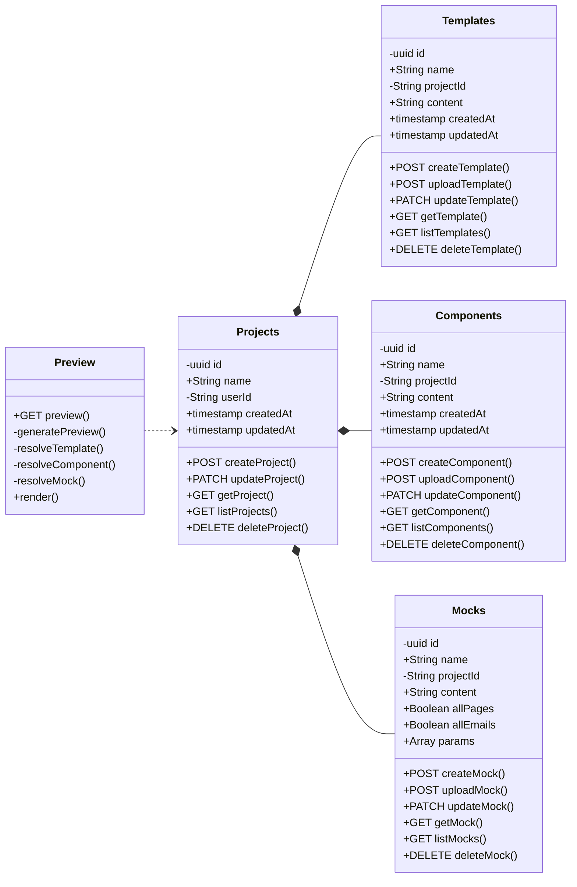

```mermaid

classDiagram
direction LR
    class Projects {
	    -uuid id
	    +String name
	    -String userId
	    +timestamp createdAt
	    +timestamp updatedAt
        +POST createProject()
        +PATCH updateProject()
        +GET getProject()
        +GET listProjects()
        +DELETE deleteProject()
    }

    class Templates {
	    -uuid id
	    +String name
	    -String projectId
	    +String content
	    +timestamp createdAt
	    +timestamp updatedAt
        +POST createTemplate()
        +POST uploadTemplate()
        +PATCH updateTemplate()
        +GET getTemplate()
        +GET listTemplates()
        +DELETE deleteTemplate()
    }

    class Components {
	    -uuid id
	    +String name
	    -String projectId
	    +String content
	    +timestamp createdAt
	    +timestamp updatedAt
        +POST createComponent()
        +POST uploadComponent()
        +PATCH updateComponent()
        +GET getComponent()
        +GET listComponents()
        +DELETE deleteComponent()
    }

    class Mocks {
	    -uuid id
	    +String name
	    -String projectId
	    +String content
	    +Boolean allPages
	    +Boolean allEmails
	    +Array params
        +POST createMock()
        +POST uploadMock()
        +PATCH updateMock()
        +GET getMock()
        +GET listMocks()
        +DELETE deleteMock()
    }

    class Preview {
        +GET preview()
        -generatePreview()
        -resolveTemplate()
        -resolveComponent()
        -resolveMock()
        +render()
    }

    Preview ..> Projects

    Projects *-- Templates
    Projects *-- Components
    Projects *-- Mocks


```
